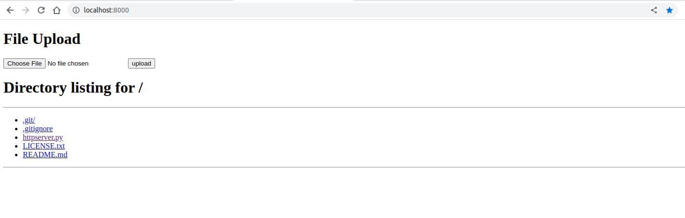

# Python Http Server

## Feature

- Support download file
- Support upload file

## Run

```shell
python3 ./httpserver.py port
```

or

```shell
./httpserver.py port
```

Should specify the **port** in your environment, if you do not, the port number is `8000` by default.

Open browser and enter `ip addr:port`, or `http://localhost:port`, refer to 

## License

`pyhttpserver` licensed under the **Apache license**, check the [LICENSE](./LICENSE.txt) file.
